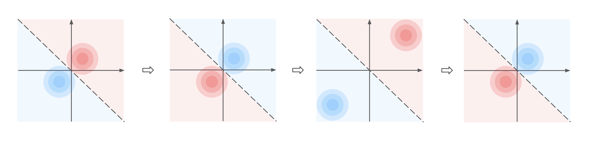

# Nash Equilibria and Pitfalls of Adversarial Training in Adversarial Robustness Games

This is the official implementation for our paper [Nash Equilibria and Pitfalls of Adversarial Training in Adversarial Robustness Games](https://arxiv.org/abs/2210.12606). We provide experiments showing the non-convergence of adversarial training when considered in terms of an alternate best-response strategy in a linear adversarial robustness game. We show that optimal adversarial training (OAT) that directly solve for a Nash equilibrium of the adversarial robustness game converges and leads to a robust model.

## Adversarial robustness game
We formulate the problem of learning a robust function $f$ as a 2-player zero-sum game between an adversary (row player) and a defender (column player). The game is played repeatedly where at each time $t$, the row player outputs a perturbation function $\delta^{(t)} : \mathcal{D} \to \mathcal{B}(\varepsilon)$ that maps each data point in $D$ to a perturbation while the column player outputs a linear function $f^{(t)} = (w^{(t)})^\top x$. We consider a SVM objective where the utility of the row player is given by

$$U_{\operatorname{row}}(\delta^{(t)},w^{(t)}) := 
    \mathbb{E}_{(x,y) \sim \mathcal{D}}[l(\delta^{(t)},w^{(t)},x,y)] + \frac{\lambda}{2}||w^{(t)}||^2_2,$$
where

$$l(\delta, w,x,y) = \max(0, 1 - yw^\top (x + \delta(x,y))).$$

The goal of the row player is to find a perturbation function that maximizes the expected loss of the perturbed data given a model from the column player. The utility of the column player is the negative expected loss:

$$U_{\operatorname{col}}(\delta^{(t)},w^{(t)}) = -U_{\operatorname{row}}(\delta^{(t)},w^{(t)}),$$

where the column player wants to output a model that minimizes the expected loss given the perturbed data.

### Adversarial training

 1. The row player submits a perturbation function that maximizes the utility from the last iteration:
    $\delta^{(t)} = \argmax_{\delta: \mathcal{D} \to \mathcal{B}(\varepsilon)} U_{\operatorname{row}}(\delta,w^{(t-1)}).$
    
 2. The column player chooses a model that maximizes the utility given the perturbation  $\delta^{(t)}$:
    $w^{(t)} = \argmax_{w \in \mathbb{R}^d} U_{\operatorname{col}}(\delta^{(t)}, w).$

In practice, we achieve an approximation of the $w^{(t)}$ via stochastic gradient descent and an approximation of each instance $\delta^{(t)}(x,y)$ by projected gradient descent.

### Optimal adversarial training
We note that in the linear adversarial robustness game, we have a closed-form solution of worst-case perturbations in terms of model parameters,

$$\delta^*(x,y) = -y\varepsilon\operatorname{sign}(w).$$

We can substitute this to the minimax objective 

$$\min_w \max_{\delta} U_{\operatorname{row}}(\delta, w),$$

to directly solve for a Nash equilibrium. The objective is then reduced to a minimization objective

$$\min_w \mathbb{E}[\max(0, 1 - yw^\top (x -y\varepsilon\operatorname{sign}(w)))] + \frac{\lambda}{2}||w||^2_2.$$

## Experiments

### Synthetic dataset 
The synthetic dataset has one robust features and d non-robust features
1. $y {\sim} \operatorname{unif}\{-1,+1\}$
 2. $x_{1}=\left\{\begin{array}{ll} +y, & \text { w.p. } p; \\ -y, & \text { w.p. } 1-p, \end{array}\right.$
2.  $x_j|y \sim \mathcal{N}(y\mu, \sigma^2)$ for $j = 2,3,\dots, d+1$

Parameters for synthetic dataset
 - `d` : number of non-robust features
 - `p` : probability that a robust feature is correct
 - `mu` : mean of non-robust features
 - `sigma` : standard deviation of non-robust features
 - `eps` : perturbation budget

Train AT and OAT on the synthetic dataset and plot accuracy, robust accuracy and weight difference.

    experiment_synthetic.ipynb
### MNIST dataset
We run experiments on a binary classification task between digits $0$ and $1$ on MNIST dataset 

Train AT and OAT on the MNIST dataset and plot accuracy, robust accuracy and weight difference. Plot ablations on the perturbation budget and the number of gradient step.

    experiment_mnist.ipynb

## Citation

    @article{balcan2022nash,
	    title={Nash equilibria and pitfalls of adversarial training in adversarial robustness games},
	    author={Balcan, Maria-Florina and Pukdee, Rattana and Ravikumar, Pradeep and Zhang, Hongyang},
	    journal={arXiv preprint arXiv:2210.12606},
	    year={2022}
    }

 

